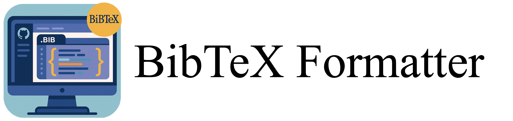

<h1 align="center">
  
</h1>
<p align="center">Standardizing the complicated BibTeX format.</p>

## :diamonds: What is this repo?

This repository provides a script and configuration file for formatting the structure of input `.bib` file.

### :whale: Requirements and Setup
```
# clone the repository
git clone git@github.com:shutech2001/bibtex-formatter.git

# build the environment with poetry
poetry install

# activate virtual environment
eval $(poetry env activate)

# [Option] to activate the interpreter, select the following output as the interpreter.
poetry env info --path
```

### :sparkles: Execution
```
$ python bibtex_formatter.py input.bib
```

#### :art: Argument
- `bibfile`
  - name of .bib file you want to format
    - e.g., `input.bib`
- `-o` | `--output`
  - specify the name of the output .bib file after formatting
    - e.g., `-o output.bib`
  - if not specified, the filename will be the original `bibfile` name with `_formatted` appended to the end.
    - e.g., if you specify `reference.bib` as `bibfile`, then output file name is `reference_formatted.bib`
- `-c` | `--case`
  - select the case for title of each BibTeX entry
    - Choices: `sentence` | `title` (Default: `sentence`)
    - e.g., `-c title`
  - if you are using APA (American Psychological Association), Chicago Author-Date, IEEE reference style, etc., choose `sentence` (default)
  - if you are using MLA (Modern Language Association), Chicago Notes-and-Bibliography, etc., choose `title`
- `-eb` | `--exclude-brace`
  - whether remove braces `{`, `}` around words that are **not** in `USER_SPECIFIED_TITLE` (Default: `True`)
- `--config`
  - path to the JSON file in which the configure is set (Default: `{Path(__file__).parent}/config.json`)
  - **In most cases, you will not need to specify this.**

### :artist: User-Specific Settings
- `config.json`
    - `USER_SPECIFIED_TITLE`
      - All words included here will be enclosed in `{` and `}` as specified in the title of each BibTeX entry.
      - Additionally, any word with `'s` attached will also be enclosed in `{` and `}`.
        - e.g., if the word of `Tamano` is included, the corresponding title of each BibTeX entry will be `{Tamano}`. Additionally, if the word `Tamano's` is included, then output will be `{Tamano's}`
    - `EXCLUDE_APOS_S`
      - If you would like to represent words in `USER_SPECIFIED_TITLE` with `'s` in lowercase, please specify them here.
        - e.g., if you include `Tamano` in `USER_SPECIFIED_TITLE` and `tamano` in `EXCLUDE_APOS_S`, `Tamano` will be output in uppercase while `tamano's` will be output in lowercase
    - `LOWER`
      - All words included here will be mainly articles and prepositions.
      - These specified words will be output in lowercase in titles, journal names, conference names, etc.
        - e.g., if you include `preprint`, the output will be `preprint`
    - `ACRONYMS`
      - All words specified here will be output as specified in journal names and conference names.
        - e.g., acronyms like `ACM` are expected to be included
    - `KEEP_ELEMENTS`
      - Adjust the fields to be output according to the entry type of each bibitem.
        - `ARTICLE_KEEP`
          - entry type: article
          - keep `ID`, `author`, `title`, `journal`, `volume`, `number`, `pages`, `year`
        - `BOOK_KEEP`
          - entry type: book
          - keep `ID`, `author`, `title`, `publisher`, `volume`, `year`
        - `INPROC_KEEP`
          - entry type: inproceedings
          - keep `ID`, `author`, `title`, `booktitle`, `pages`, `year`
        - `OTHER_KEEP`
          - others
          - keep `ID`, `author`, `title`, `year`

## :phone: Contact

If you have any features you would like to add or have any questions, please feel free to create a Pull Request or contact: stamano@niid.go.jp
